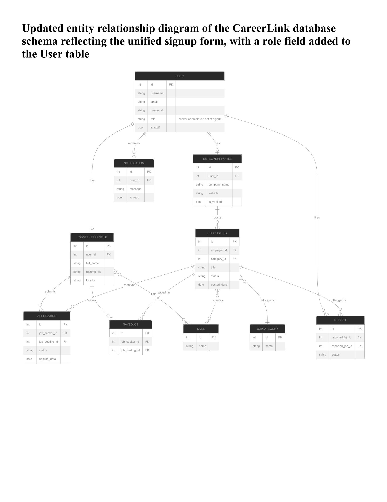

# CareerLink — Updated Entity Relationship Diagram

Updated entity relationship diagram of the CareerLink database schema reflecting the unified signup form, with a role field added to the User table.

*Figure: Updated ER Diagram — CareerLink Database Schema (unified signup form, `role` field on User table)*

## Entities

- **USER** — `id (PK)`, `username`, `email`, `password`, `role` *(seeker or employer, set at signup)*, `is_staff`
- **JOBSEEKERPROFILE** — `id (PK)`, `user_id (FK)`, `full_name`, `resume_file`, `location`
- **EMPLOYERPROFILE** — `id (PK)`, `user_id (FK)`, `company_name`, `website`, `is_verified`
- **NOTIFICATION** — `id (PK)`, `user_id (FK)`, `message`, `is_read`
- **JOBPOSTING** — `id (PK)`, `employer_id (FK)`, `category_id (FK)`, `title`, `status`, `posted_date`
- **JOBCATEGORY** — `id (PK)`, `name`
- **APPLICATION** — `id (PK)`, `job_seeker_id (FK)`, `job_posting_id (FK)`, `status`, `applied_date`
- **SAVEDJOB** — `id (PK)`, `job_seeker_id (FK)`, `job_posting_id (FK)`
- **SKILL** — `id (PK)`, `name`
- **REPORT** — `id (PK)`, `reported_by_id (FK)`, `reported_job_id (FK)`, `status`

## Relationships at a Glance

| Relationship | Type |
|---|---|
| User → JobSeekerProfile | One-to-One |
| User → EmployerProfile | One-to-One |
| User → Notification | One-to-Many |
| User → Report (files) | One-to-Many |
| EmployerProfile → JobPosting (posts) | One-to-Many |
| JobCategory → JobPosting (belongs_to) | One-to-Many |
| JobSeekerProfile → Application (submits) | One-to-Many |
| JobPosting → Application (receives) | One-to-Many |
| JobSeekerProfile → SavedJob (saves) | One-to-Many |
| JobPosting → SavedJob (saved_in) | One-to-Many |
| JobSeekerProfile ↔ Skill (lists) | Many-to-Many |
| JobPosting ↔ Skill (requires) | Many-to-Many |
| JobPosting → Report (flagged_in) | One-to-Many |
