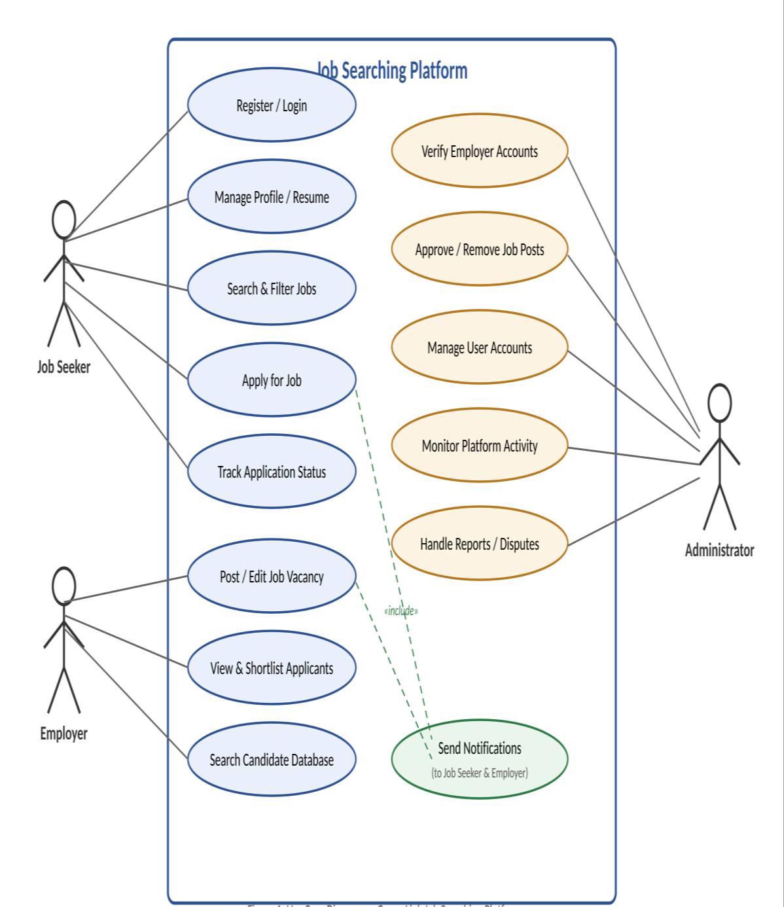
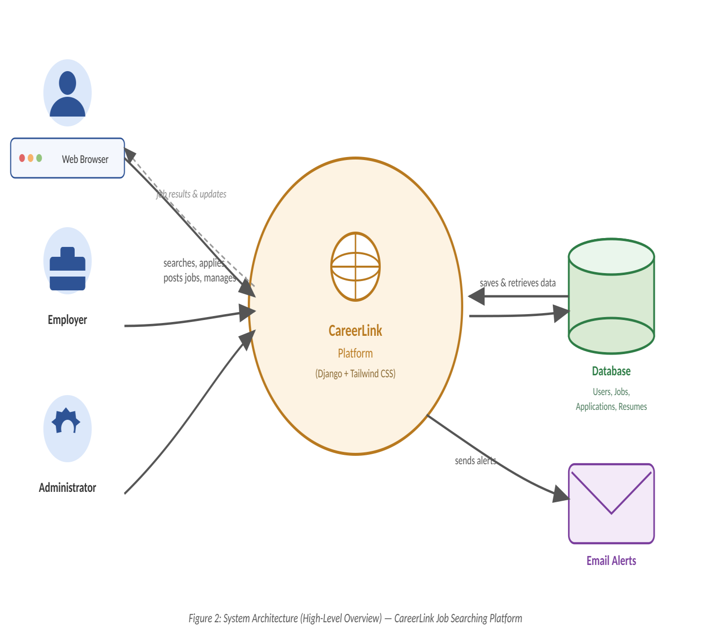
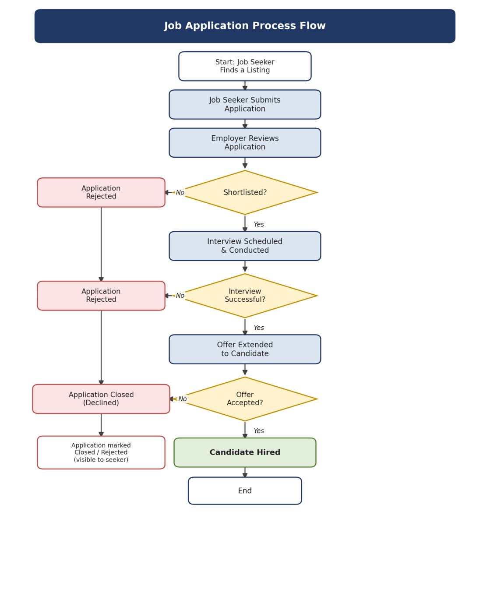
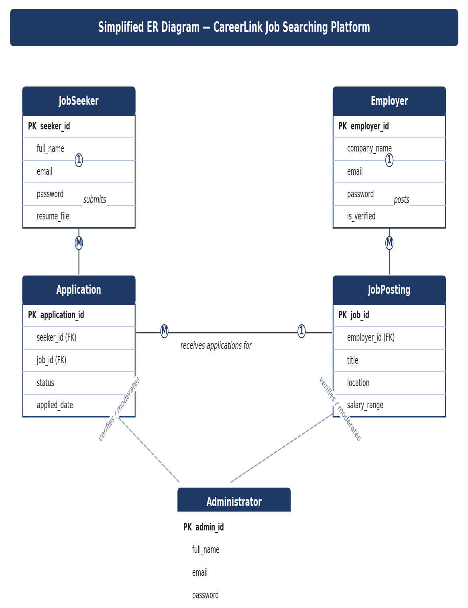

# PROJECT PROPOSAL

## CareerLink: An Online Job Searching Platform

*A web-based platform connecting job seekers with employers*

**For the fulfillment of the 3-month Internship in Code-It, Dharan**

**Date:** 2083/04/12

**Submitted by:**
Naresh Aryal || Chandan Shrestha || Anita Gurung || Kiran Thapa || Govinda Rokaya

---

## 1. Introduction

Finding the right job or the right candidate is often a slow, fragmented, and inefficient process. Job seekers spend hours browsing multiple websites, newspapers, and social media pages, while employers struggle to reach qualified candidates quickly. This project proposes the design and development of **"CareerLink,"** a centralized, web-based career and job searching platform that connects job seekers with employers in a fast, transparent, and user-friendly environment.

The platform will allow registered job seekers to create profiles, upload resumes, search and filter job listings, and apply directly through the site. Employers will be able to register their organizations, post job vacancies, manage applications, and search a database of candidate profiles. An administrative panel will oversee platform activity, verify employer accounts, and maintain overall system integrity.

---

## 2. Problem Statement

- Job listings are scattered across newspaper classifieds, word of mouth, and multiple disconnected websites, making a single, comprehensive search difficult.
- Job seekers have no easy way to track the status of applications they have submitted across different sources.
- Employers struggle to efficiently screen large volumes of unqualified applicants, wasting time and resources.
- Many employers rely on costly third-party recruitment agencies simply to reach a sufficient pool of qualified candidates.
- There is no centralized, transparent platform that lets job seekers and employers connect directly and efficiently.

---

## 3. Objectives

The primary objective of this project is to design and develop a functional online job searching website. The specific objectives are:

1. To provide a centralized platform where employers can post job vacancies and job seekers can search and apply for them.
2. To allow job seekers to create profiles, build resumes, and track the status of their applications.
3. To enable employers to manage job postings, review applicant profiles, and shortlist candidates.
4. To implement an advanced search and filter system based on job title, location, category, experience level, and salary range.
5. To build a secure authentication system with distinct roles for job seekers, employers, and administrators.
6. To provide an admin dashboard for monitoring platform activity, moderating content, and managing users.
7. To ensure the platform is responsive, accessible, and usable across desktop and mobile devices.
8. To successfully complete this project by applying the concepts, tools, and skills learned during the 1.5-month Django training course, thereby fulfilling the requirements of the Django internship through practical, hands-on implementation of all the features covered in the course.

---

## 4. Scope of the Project

The proposed system will cover the core functionalities required to operate a job search platform. The scope includes user registration and authentication, job posting and browsing, application submission and tracking, resume/profile management, search and filtering, and administrative controls. Advanced features such as AI-based job matching, video interviews, or payment gateway integration for premium listings are considered possible future enhancements and are outside the initial scope, but the architecture will be designed to accommodate them later.

---

## 5. Existing System vs. Proposed System

### 5.1 Limitations of Existing Systems

- Job listings are scattered across multiple platforms, newspapers, and social media, making comprehensive searches difficult.
- Manual application tracking leads to missed opportunities and poor communication between employers and candidates.
- Limited or no filtering options make it hard to find relevant, location- and skill-specific jobs.
- Employers often depend on costly third-party recruitment agencies to reach candidates.

### 5.2 Advantages of the Proposed System

- A single, centralized platform for both job seekers and employers.
- Real-time job posting, searching, and application tracking.
- Advanced filters for faster, more relevant search results.
- Reduced hiring costs for employers and reduced search time for candidates.
- A secure, role-based system that protects user data and privacy.

---

## 6. System Features / Modules

### 6.1 Job Seeker Module

- Account registration, login, and profile management.
- Resume builder / resume upload (PDF or DOC).
- Job search with keyword, category, location, and salary filters.
- Online job application and application-status tracking.
- Saved jobs and email/notification alerts for new matching postings.

### 6.2 Employer Module

- Company registration and profile verification.
- Post, edit, and remove job vacancies.
- View, filter, and shortlist applicants.
- Search the candidate/resume database.
- Dashboard showing posting performance and application statistics.

### 6.3 Administrator Module

- Manage and verify employer and job-seeker accounts.
- Approve, edit, or remove job postings that violate platform policy.
- Monitor overall platform activity through an analytics dashboard.
- Handle user reports, disputes, and support requests.

---

## 7. System Design Diagrams

### 7.1 Use Case Diagram

The use case diagram below illustrates how the three actors — Job Seeker, Employer, and Administrator — interact with the system's main functions.

*Figure 1: Use Case Diagram — CareerLink Job Searching Platform*

### 7.2 System Architecture

The diagram below gives a simple, high-level picture of how the platform works: job seekers and employers interact with the website through their browsers, the Django-powered platform in the middle handles all the logic and matching, and the database securely stores all the data — with email notifications sent back out to users.

*Figure 2: System Architecture (High-Level Overview) — CareerLink Job Searching Platform*

### 7.3 Flowchart — Job Application Lifecycle

The flowchart below shows the lifecycle of a single job application as it moves through the system, from the moment a job seeker applies to its final outcome. Each decision point reflects a status change that will be tracked and displayed to both job seekers and employers throughout the process.

*Figure 3: Flowchart — Job Application Lifecycle (CareerLink Job Searching Platform)*

### 7.4 Entity-Relationship (ER) Diagram

The simplified ER diagram below outlines the core data entities of the platform — Job Seeker, Employer, Job Posting, Application, and Administrator — and the relationships between them. Each Job Seeker can submit many Applications, each Job Posting can receive many Applications, and each Employer can create many Job Postings, while the Administrator oversees and verifies both Job Seeker and Employer accounts.

*Figure 4: Simplified ER Diagram — CareerLink Job Searching Platform*

---

## 8. Technology Stack

| Layer | Proposed Technology |
|---|---|
| Frontend | HTML5, Tailwind CSS, JavaScript, Django Templates |
| Backend | Python, Django (Django REST Framework for APIs where needed) |
| Database | SQLite (development) / PostgreSQL (production) |
| Authentication | Django's built-in authentication system with role-based access control |
| Hosting | Cloud hosting (e.g., AWS, Render, or Vercel/Netlify for frontend) |
| Version Control | Git and GitHub |

---

## 9. Development Methodology

This project will be developed using the **Iterative Model** of the software development life cycle. Rather than building the entire platform in a single pass, the system will be developed through repeated cycles, where each iteration adds a working set of features on top of the previous one. Every iteration involves planning, design, implementation, and testing, allowing the platform to evolve gradually while incorporating feedback and improvements after each cycle.

This approach was chosen because it suits a learning-based project: core functionality (such as user authentication and basic job posting) can be built and tested first, with more advanced features (such as filtering, dashboards, and notifications) added in later iterations as the corresponding concepts are learned and practiced during the course. It also reduces risk, since issues in one iteration can be identified and corrected before moving on to the next, and it keeps a working version of the platform available at every stage of development.

**The planned iterations for this project are:**

1. **Iteration 1:** Project setup, Django environment configuration, and basic authentication (registration/login) for job seekers and employers.
2. **Iteration 2:** Core job posting and job browsing functionality, along with basic profile management.
3. **Iteration 3:** Job application workflow, application tracking, and employer-side applicant management.
4. **Iteration 4:** Search and filter features, notifications, and UI refinement using Tailwind CSS.
5. **Iteration 5:** Administrator module, testing, bug fixing, and final deployment.

---

## 10. Project Timeline

| Phase | Duration | Deliverable |
|---|---|---|
| Requirement Analysis & Planning | Week 1–2 | Approved proposal & SRS document |
| System Design (UI/UX & Database) | Week 3–4 | Wireframes & ER diagram |
| Frontend Development | Week 5–7 | Functional UI pages (Django Templates + Tailwind CSS) |
| Backend & Database Development | Week 6–9 | Django models, views, and database integration |
| Integration & Testing | Week 10–11 | Tested, bug-free system |
| Deployment & Documentation | Week 12 | Live deployment & final report |

---

## 11. Expected Outcome

At the end of this project, a fully functional job searching website will be delivered, enabling job seekers to search and apply for jobs efficiently while allowing employers to post vacancies and manage applicants with ease. The platform will demonstrate practical application of full-stack web development, database design, and secure authentication practices.

---

## 12. Conclusion

The proposed CareerLink platform addresses a real-world need by simplifying and centralizing the job search and recruitment process. By combining a clean user interface with a robust backend and secure data handling, the project aims to deliver a practical, scalable solution that benefits both job seekers and employers. This proposal outlines the objectives, scope, technical approach, and timeline required to successfully complete the project.
